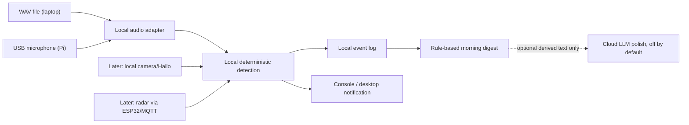

# Lullaby — tiered build plan and bill of materials

> Companion to [baby-monitor-evaluation.md](baby-monitor-evaluation.md). Live status and locked decisions are in [memory.md](memory.md).

## The build in one line

A privacy-first companion beside the cot, tethered to a vented compute base, that detects locally, logs the night, and later tries one selected soothe preset before notifying a parent.

## Architecture

## Tier 0 — audio spine (must ship first)

1. Read a `.wav` on a laptop or microphone frames on the Pi.
2. Run local YAMNet baby-cry detection behind an interface.
3. Apply deterministic confidence, sustained-duration, debounce, and cooldown rules.
4. Write timestamped JSON and readable text night logs.
5. Produce a rule-based morning digest.
6. Notify once when crying is sustained, not on every model blip.
7. Keep optional LLM polish disabled by default.

**Acceptance:** the included sample recording produces detections, a night log, a digest, and one sustained-cry notification without hardware or an API key.

## Tier 1 — soothe preset and best-guess hunger

Approved on 2026-06-21 and started laptop-first. The first slice adds a
configurable dry-run soothe preset that records one soothe attempt, waits, and
notifies only if crying persists. The parent chooses one mode such as white
noise, heartbeat-style pulses, or soothing music; Lullaby does not cycle
through all sounds automatically. Next, play the selected local preset at low
volume on a laptop before moving to the Pi speaker/amplifier bench test.
“Likely hungry” may combine cry plus time since feed, but is always a labelled
best guess.

Generated local placeholder assets now cover a stronger uterine-style whoosh,
white noise, heartbeat-style pulses, and soothing music. They are for testing
the preset and audio-output path; they are not evidence that any sound will
settle a baby.

The soothe player loops the selected short local WAV file for the configured
play window. Presets are configured for 30 minutes because a real settling
window may be much longer than a preview clip.

## Tier 2 — local video

Add file/OpenCV and picamera2/Hailo adapters for active/still and face-covered observations. Raw video never leaves the device.

## Tier 3 — radar

Add MR60BHA2 presence and gross movement through its ESP32 Wi-Fi/MQTT bridge. Any breathing display is a non-medical trend only, requires mentor sign-off, and never triggers an alarm.

## Tier 4 — room environment and nappy best guess

Add BME688 room temperature/humidity and a calibrated nappy-VOC best guess. Do not infer body temperature.

## Tier 5 — optional thermal trend

Add MLX90640 relative warmth trend only. Never describe it as fever detection or a thermometer. Default: cut this tier.

## Product/app layer — after the local core

Mo wants the parent-facing app capabilities seen in mainstream baby-monitor
apps, but they must be sequenced after the local privacy-first core:

1. Multiple trusted parent devices through household pairing.
2. Family sharing with roles, invite/revoke controls, and an audit trail.
3. Push alerts for sustained crying/noise after the deterministic debounce
   rules fire.
4. Connection and power-health alerts for Pi heartbeat, camera/microphone
   availability, under-voltage, thermal throttling, and any future UPS/battery.
5. Night vision only after NoIR/IR hardware, physical mounting, and thermal
   checks pass.
6. Local live video only after the Tier 2 gates. Remote raw video is not part
   of the current privacy boundary and would need a separate explicit decision.
7. No ads in the core monitoring app. Any subscription must be optional and
   must not be required for local monitoring, logging, alerts, or soothing.

## Hardware on hand

Pi 5 4GB; Active Cooler; official 27W PSU; AI HAT+ 26 TOPS/Hailo-8; Camera Module 3 ×2; Pi 5 camera cable; USB microphone; MAX98357 I²S amplifier ×2; 3W 4Ω speaker ×4; INMP441 MEMS mic ×4; BS-16 speaker; 0.96-inch I²C OLED ×4; 0.91-inch I²C OLED ×2; PCA9685 16-channel servo driver ×3; MG996R servo ×4; Miuzei 9g micro servo ×10; SG90 9g micro servo ×10; USB-C PD trigger board ×5; Seeed MR60BHA2 60GHz mmWave sensor with XIAO ESP32C6; Pimoroni BME688 4-in-1 air quality breakout; HC-SR04 ultrasonic distance sensor ×5; VL53L0X laser distance/ToF sensor ×5; 32GB microSD; breadboards, jumpers, wire, screws, and electronics tools.

Detailed wiring, install commands, and bench-test order live in
[hardware-guide.md](hardware-guide.md).

## Later purchases or checks

| Item | Tier | Why |
|---|---:|---|
| Vented Pi/Hailo base | Deployment | Thermal safety |
| Speaker amplifier, if required | 1 | Drive the BS-16 safely |
| NoIR Camera Module 3 + 850nm IR illuminator | 2 | Dark-room video |
| Cot-safe mount | 2 | Stable view and cables out of reach |
| MR60BHA2 mounting, signal, and ESPHome/MQTT check | 3 | Presence/gross movement |
| BME688 placement, calibration, and hygiene check | 4 | Room environment and experimental VOC |
| VL53L0X distance/proximity bench check | Utility | Preferred distance/proximity sensor for mount/enclosure experiments |
| HC-SR04 distance/proximity bench check | Utility | Optional, but needs voltage divider; not baby-state inference |
| MLX90640 | 5 | Optional relative warmth trend |

Prices and availability change; verify before buying. Tier 0 laptop development requires no purchase.

## Framing and cut rules

- No SIDS, apnoea, fever, diagnosis, or vital-sign claims.
- Best-guess labels on cry reason, hunger, nappy, warmth, and similar inferences.
- Raw audio/video remains local.
- Detection/timing works with the LLM off.
- Hot compute is vented and separate from any soft companion.
- Companion beside the cot, never in it.
- Cut from Tier 5 downward. Tier 0 and the safety/privacy boundaries are protected.
