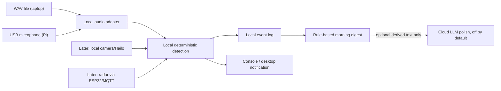

# Lullaby — tiered build plan and bill of materials

> Companion to [baby-monitor-evaluation.md](baby-monitor-evaluation.md). Live status and locked decisions are in [memory.md](memory.md).

## The build in one line

A privacy-first companion beside the cot, tethered to a vented compute base, that detects locally, logs the night, and later tries a gentle soothe step before notifying a parent.

## Architecture

## Tier 0 — audio spine (must ship first)

1. Read a `.wav` on a laptop or microphone frames on the Pi.
2. Run local YAMNet baby-cry detection behind an interface.
3. Apply deterministic confidence, sustained-duration, debounce, and cooldown rules.
4. Write timestamped JSON and readable text night logs.
5. Produce a rule-based morning digest.
6. Notify once when crying is sustained, not on every model blip.
7. Keep optional LLM polish disabled by default.

**Acceptance:** the included sample recording produces detections, a night log, a digest, and one sustained-cry notification without hardware or an API key.

## Tier 1 — soothe ladder and best-guess hunger

Play a configurable lullaby, white noise, or recorded parent voice, wait, and notify only if crying persists. “Likely hungry” may combine cry plus time since feed, but is always a labelled best guess.

## Tier 2 — local video

Add file/OpenCV and picamera2/Hailo adapters for active/still and face-covered observations. Raw video never leaves the device.

## Tier 3 — radar

Add MR60BHA2 presence and gross movement through its ESP32 Wi-Fi/MQTT bridge. Any breathing display is a non-medical trend only, requires mentor sign-off, and never triggers an alarm.

## Tier 4 — room environment and nappy best guess

Add BME688 room temperature/humidity and a calibrated nappy-VOC best guess. Do not infer body temperature.

## Tier 5 — optional thermal trend

Add MLX90640 relative warmth trend only. Never describe it as fever detection or a thermometer. Default: cut this tier.

## Hardware on hand

Pi 5 4GB; Active Cooler; official 27W PSU; AI HAT+ 26 TOPS/Hailo-8; Camera Module 3 ×2; Pi 5 camera cable; USB microphone; three I²C OLEDs; BS-16 speaker; 32GB microSD; breadboards, jumpers, and electronics tools.

## Later purchases or checks

| Item | Tier | Why |
|---|---:|---|
| Vented Pi/Hailo base | Deployment | Thermal safety |
| Speaker amplifier, if required | 1 | Drive the BS-16 safely |
| NoIR Camera Module 3 + 850nm IR illuminator | 2 | Dark-room video |
| Cot-safe mount | 2 | Stable view and cables out of reach |
| MR60BHA2 + ESP32 bridge | 3 | Presence/gross movement |
| BME688 | 4 | Room environment and experimental VOC |
| MLX90640 | 5 | Optional relative warmth trend |

Prices and availability change; verify before buying. Tier 0 laptop development requires no purchase.

## Framing and cut rules

- No SIDS, apnoea, fever, diagnosis, or vital-sign claims.
- Best-guess labels on cry reason, hunger, nappy, warmth, and similar inferences.
- Raw audio/video remains local.
- Detection/timing works with the LLM off.
- Hot compute is vented and separate from any soft companion.
- Companion beside the cot, never in it.
- Cut from Tier 5 downward. Tier 0 and the safety/privacy boundaries are protected.
