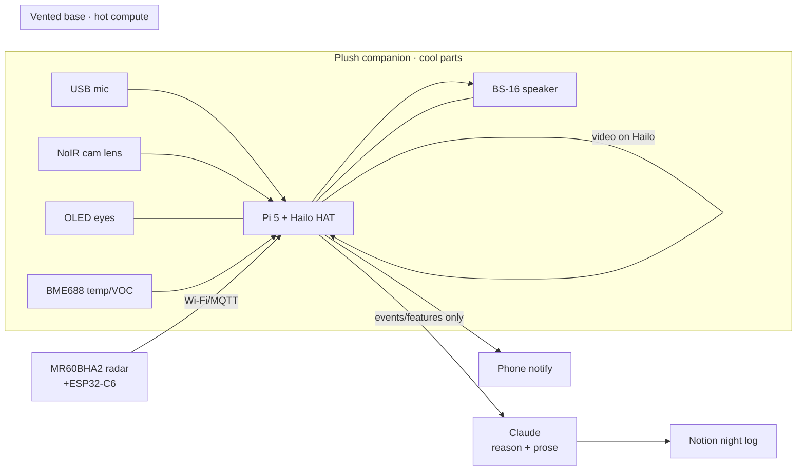

# meshmesh baby‑monitor — 1‑week build plan + BOM

> Companion to [meshmesh-baby-monitor-eval.md](meshmesh-baby-monitor-eval.md). Standalone on branch `claude/meshmesh-baby-monitor-eval-x8pkue`; touches no Lab Witness file.
> Read the eval's **§7 reviewer gate** first — the conditions below come from it.

## The build in one line
A **plush companion** that sits *beside* the cot: hidden mic + radar + sensors and OLED "eyes", tethered to a **vented base** holding the hot Pi 5 + Hailo HAT. It **detects → fuses → logs (Notion) → soothes → notifies** — an *assistive night notebook, not a medical guardian*.

## Architecture (load distributed off the 4GB Pi)

*Why it fits 4GB:* video runs on the Hailo, radar on its own ESP32, the LLM in the cloud event‑driven; only light glue (YAMNet detect, sensor polling, state machine, Notion writes) sits on the Pi CPU. Budget = CPU + integration time, not RAM. *(Confirm on the rig — Rule #1.)*

---

## Sequenced tiers (each ships value alone — cut from the bottom if the week runs out)

**Tier 0 — Spine (must‑ship).** USB mic → YAMNet TFLite cry/sound detect; **NoIR camera** night‑movement (active/still, face‑covered, roll‑over) via Hailo; → **Notion night‑log + phone notify**. OLED eyes show state. *This alone is a complete, honest demo.*

**Tier 1 — Hunger inference (no new hardware).** Fuse cry + time‑since‑feed + rooting‑on‑camera in Claude → best‑guess *"likely hungry."* Add the **soothe ladder** (lullaby/white‑noise/parent's voice via BS‑16) → escalate to phone only if it persists.

**Tier 2 — Radar movement/presence.** MR60BHA2 (+ESP32‑C6) for presence + gross movement in the dark — privacy‑first (camera optional). *Gate: ESP32→MQTT→Pi bridge working.*

**Tier 3 — Breathing as INSIGHT only.** Same radar. 🚨 **Gated: mentor sign‑off + explicit non‑medical framing; never an alarm, never the safety mechanism.** Show as a sleep *trend*, not a vital sign.

**Tier 4 — Nappy + nursery temp.** BME688 → dirty‑nappy best‑guess (VOC) **+** ambient temperature/humidity (one part). Nursery‑overheating is a real AAP safe‑sleep factor — defensible. *Body/skin temp out of scope (medical).*

**Tier 5 — Thermal "warmth insight" (optional, lowest priority, riskiest).** MLX90640 array → relative warmth trend + demo overlay. **NOT a thermometer, NOT fever detection** (skin≠core; non‑contact IR unreliable). Default: **park or cut**.

---

## BOM — shoppable + evidenced
Prices are **approximate — verify at checkout** (live UK pricing shifts; Rule #1: no firm price stated as fact). "Cheaper clone" = AliExpress/generic exists at lower cost with reliability/lead‑time risk; for a 1‑week sprint, reputable‑UK is usually worth it.

| Part | Does what | On hand? | Cheapest reputable (UK) | ~£ | Tier | Blocks v0? | Integration evidence |
|---|---|---|---|---|---|---|---|
| Pi 5 4GB + cooler + 27W PSU | The hub | ✅ have | — | — | 0 | — | — |
| AI HAT+ 26 TOPS (Hailo‑8) | Video inference | ✅ have | — | — | 0 | — | fitted to Pi 5 |
| USB mini microphone | Cry/sound capture | ✅ have | — | — | 0 | — | standard USB audio |
| 3× 0.91" OLED | Animated eyes + status | ✅ have | — | — | 0 | — | I²C on Pi GPIO |
| BS‑16 speaker | Talk‑back/soothe | ✅ have | — | — | 1 | — | may need a small amp (mentor Q) |
| **NoIR Camera Module 3** | **Night vision** (not temp) | ❌ buy | [The Pi Hut](https://thepihut.com/products/raspberry-pi-camera-module-3-noir) | ~30 | 0 | **YES** | native Pi CSI |
| **Pi‑5 camera adapter cable** (22→15‑pin) | Connect cam to Pi 5 | ❌ buy | [The Pi Hut](https://thepihut.com/products/raspberry-pi-camera-cable-standard-mini) | ~3 | 0 | **YES** | Pi 5 socket gotcha (checklist §2) |
| 850nm IR illuminator | See in the dark | ❌ buy | Amazon UK (generic IR LED board) | ~6 | 0 | YES (with NoIR) | pairs with NoIR |
| micro‑HDMI adapter *or* headless | Setup/display | ❌ buy/skip | [The Pi Hut](https://thepihut.com/products/micro-hdmi-to-hdmi-cable-1m) | ~5 | 0 | no (headless works) | Pi 5 micro‑HDMI |
| Cot‑safe overhead/side mount | Steady framing, cable out of reach | ❌ buy/print | improvise / 3D print | ~0–15 | 0 | recommended | — |
| Vented base/enclosure | House hot Pi+HAT+fan safely | ❌ buy/print | 3D print at workshop | ~0–10 | 0 | **safety** | thermal (checklist §5) |
| **MR60BHA2 radar (+XIAO ESP32‑C6)** | Movement/presence (+breathing) | ❌ buy | [The Pi Hut](https://thepihut.com/products/60ghz-mmwave-breathing-and-heartbeat-detection-sensor-mr60bha2) | ~37 | 2–3 | no (own tier) | [Seeed wiki](https://wiki.seeedstudio.com/ha_with_mr60bha2/) · [ESPHome components](https://github.com/limengdu/MR60BHA2_ESPHome_external_components) — ESP32→Wi‑Fi/MQTT→Pi, **not native Pi** |
| **BME688 4‑in‑1 breakout** | Nappy VOC + nursery temp/humidity | ❌ buy | [The Pi Hut](https://thepihut.com/products/bme688-4-in-1-air-quality-breakout-gas-temperature-pressure-humidity) | ~16 | 4 | no (own tier) | I²C onto Pi GPIO 1/3/5/7/9; nappy‑VOC proof: [Arduino](https://blog.arduino.cc/2023/08/15/this-smart-diaper-knows-when-it-is-ready-to-be-changed/) |
| MLX90640 thermal array (optional) | Warmth trend (not fever) | ❌ buy | [Pimoroni](https://shop.pimoroni.com/products/mlx90640-thermal-camera-breakout) | ~45 | 5 | no | I²C; [Pi build guide](https://everythingsmarthome.co.uk/building-a-raspberry-pi-thermal-imaging-camera-mlx90640-guide/) |
| Plush toy shell | The companion body | ❌ buy | high‑street/Amazon | ~10 | 0 | no | — |

**Minimum to start (Tier 0):** NoIR cam + Pi‑5 cable + IR illuminator + plush + mount/base ≈ **£50–65**. Full suite incl. radar + BME688 + thermal ≈ **£150–170**. *(All verify at checkout.)*

---

## Framing & cut rules (the discipline that protects the build)
- **Best‑guess only:** cry‑reason, hunger, nappy are probabilistic — labelled as such, never truth.
- **Breathing = insight, never an alarm**, mentor sign‑off required (Tier 3).
- **No raw audio/video leaves the device** — features/text only to Claude.
- **No medical/SIDS/apnoea/fever claims anywhere.** Temp = ambient room only.
- **Plush beside the cot, never in it** (AAP safe‑sleep — soft objects out of the sleep surface).
- **No local LLM** unless offline‑privacy is judged; cloud Claude is the brain.
- Cut from the bottom (Tier 5 → 2) if time runs short. Tier 0 is sacred.

## Mentor questions (carried from the reviewer gate)
1. **Independently, what breathing accuracy does the MR60BHA2 give at cot distance?** — gates whether Tier 3 is worth showing (vendor figure unverified).
2. **Is the vented‑base + plush‑face split thermally safe for an all‑night run?** — fire/burn risk.
3. **Best cot‑side mount keeping the mains cable out of reach?** — infant safety.
4. **Does the BS‑16 speaker need a small amp off the Pi?** — talk‑back path.
5. **Cheapest way to keep inference on‑device while using cloud Claude for prose only?** — privacy line.

## Verify it works (end‑to‑end)
1. **Tier 0:** play a recorded baby cry near the mic in a dark room → OLED eyes change + phone notification + a Notion line within seconds; NoIR feed visible in the dark.
2. **Tier 1:** simulate "4h since feed" + a cry → log reads *"likely hungry (best guess)"*; soothe audio plays before the phone escalates.
3. **Tier 2–3:** radar reports presence/movement with no camera; breathing shows as a *trend* labelled non‑medical.
4. **Tier 4:** BME688 reports a plausible room temp; a soiled‑nappy VOC bump flags best‑guess.
5. **Privacy check:** confirm only events/features/text leave the device (no raw A/V).
6. **Thermal check:** run the base for a full night; confirm it stays within safe temps (mentor‑confirmed).
