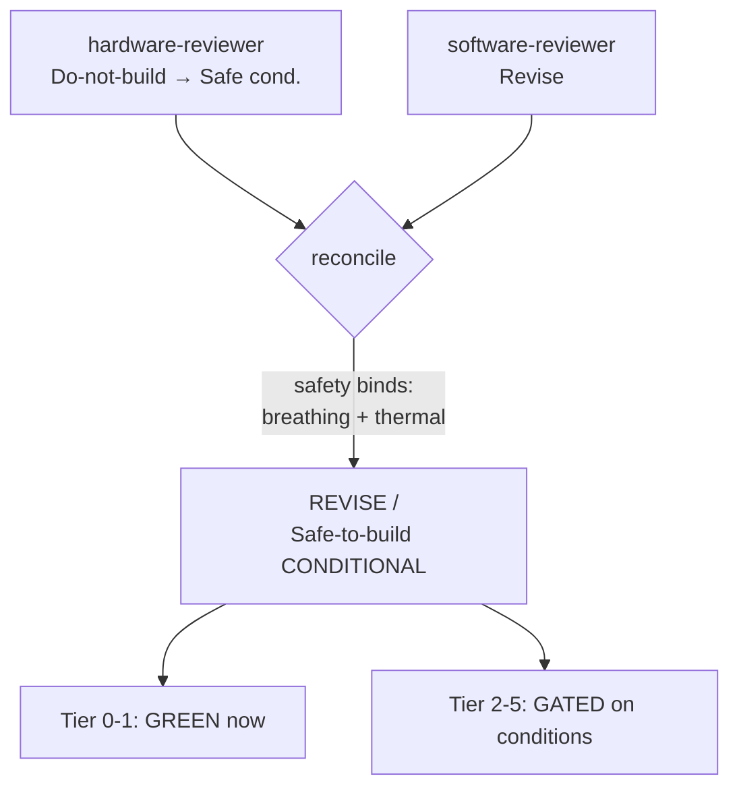

# meshmesh baby‑monitor — evaluation & reviewer gate

> Standalone evaluation doc on branch `claude/meshmesh-baby-monitor-eval-x8pkue`.
> Self‑contained — does **not** touch any Lab Witness file. Companion: [meshmesh-baby-monitor-build-plan.md](meshmesh-baby-monitor-build-plan.md).
> British English. Written for Mo (physician‑scientist, new to hardware, ADHD, newborn = live test subject).

## ⚠️ Framing assumption (correct me if wrong)
"meshmesh" is treated here as a **separate / personal build**, ~1‑week scope, using your newborn as the live test subject — **not** a pivot off Lab Witness (whose 24 Jun v0 freeze stays sacred). If it's actually a pivot, the opportunity‑cost call below changes.

Two terms decoded: **"claw"** = Claude (cloud LLM); **"hermes"** = a local open LLM (Nous Hermes / Llama‑class). Recommendation lands on **Claude in the cloud, event‑driven** (see §3).

---

## TL;DR verdict
- **As a personal build: strong.** You own ~90% of the hardware and have a live subject. Genuinely motivating, very demoable.
- **As a competition entry: great deployment, weak novelty as "a baby monitor," real downside risk.** Cry detection is crowded — commercial (Cubo AI, Nanit, ChatterBaby) *and* DIY (multiple open‑source Pi builds).
- **The defensible reframe = your Lab Witness bet pointed at a cot:** a passive **multimodal companion that logs the night and surfaces best‑guess insights**, with an honest *"assistive notebook, not a medical guardian"* line — plus a **proactive soothe loop** as the wow. The **plushie form factor** (OLED eyes, talk‑back speaker) is what lifts novelty and softens the surveillance vibe.
- **Reviewer gate (your own skills): REVISE / Safe‑to‑build‑conditional.** Build Tier 0–1 now; gate Tiers 2–5 on the safety/framing conditions in §8.

---

## 1. Hardware fit — excellent (the strongest argument *for*)
You already own most of the bill of materials, and the bits "parked" for Lab Witness become the heroes:

| Need | On hand | Note |
|---|---|---|
| Brain | Pi 5 (4GB) + active cooler + 27W PSU | Orchestrator/hub — see §6 |
| **Ears (primary)** | **USB mini microphone** | Cry detection is audio‑first |
| Eyes | 2× Camera Module 3 | But not IR — night gap (§7) |
| Video AI | **AI HAT+ 26 TOPS (Hailo‑8)** | Use for *video*, not audio |
| Talk‑back / soothe | Mini speaker (BS‑16) | Lullaby / white‑noise / parent voice |
| **Face/UI** | **3× 0.91" OLED** | Animated **eyes** in the plush + hidden status |
| Bench | Full solder station, 3D printer | Better equipped than most teams |

**Real gaps (cost time/money):** night vision (Cam Module 3 is **not** IR → NoIR + IR illuminator), the Pi‑5 camera adapter cable (known gotcha), mic quality/placement, a vented enclosure for the hot compute, and a cot‑safe mount. See the BOM in the build plan.

---

## 2. Models — what classifies cries, and how far to trust it
Two **different** problems — conflating them is the classic trap:

**(a) Cry *detection* ("is a baby crying?") — solid, deployable today.**
- **YAMNet** (Google/AudioSet) already has a *"Baby cry, infant cry"* class; runs as **TFLite on a Pi**, no training. Zero‑effort trigger.
- Better: YAMNet embeddings → small CNN. A 2025 published system did this on a **Pi 4B at 95.2% acc / F1 0.93 / <0.8s** ([ScienceDirect](https://www.sciencedirect.com/science/article/pii/S2666827025001744)). *(Vendor/paper figure — treat as indicative, re‑measure on your rig: Rule #1.)*
- Runs on the **CPU**, leaving the Hailo free for video.

**(b) Cry *interpretation* ("why crying?") — demos well, scientifically shaky.**
- Tiny datasets: **Donate‑a‑Cry** ≈ 457 files, 5 classes. Papers report 85–93% *on that set*; external validity to *your* baby is weak.
- Ready‑made: [`CryMLClassifier`](https://github.com/echoCodeScript/Infant-Cry-Classification-ML-Model), [`Nerdy37/baby-cry-analyzer`](https://hf.co/Nerdy37/baby-cry-analyzer) (MFCC ensemble).
- **As a physician‑scientist this is your credibility lever:** label it a *probabilistic best guess*, show uncertainty, never present as truth. That honesty differentiates you from the apps that overclaim.

**Verdict:** detection = reliable & easy; interpretation = a caveated "wow." **Don't put audio on the Hailo** — it runs trivially on CPU; the HAT earns its keep on video.

---

## 3. The LLM / proactive layer ("claw / hermes") — where novelty lives
Reactive "cry → ping" is what everyone ships. The value is the **reason + log + proactive** layer:
1. **Night log / digest (your wheelhouse).** "3 wakings, longest settle 12 min, first cry 23:40" → a nightly Notion entry, reusing your **Granola→Notion** pipeline.
2. **Multimodal fusion (the real LLM edge).** cry + time‑since‑feed + video (rooting/eyes‑open) + radar movement → *"likely hunger — 4h since feed."* This is where an LLM beats a classifier.
3. **Proactive soothe ladder.** detect → auto‑play lullaby/white‑noise/**parent's voice** → wait → escalate to phone only if it persists. The demo "wow."
4. **Natural‑language Q&A.** "How did she sleep?"

**Brain choice:** **Claude (Haiku‑class), cloud, event‑driven** — cheap (fires on events), zero local RAM, and you send **features/text, not raw infant audio**. Local **Hermes/Llama** only buys fully‑offline privacy at the cost of quality + RAM pressure on 4GB + setup time — not worth it for a 1‑week demo (but "runs offline" is a good story if privacy is judged). Mirrors Lab Witness's *local‑first inference, cloud LLM for prose only.*

---

## 4. Available solutions — you won't be first (novelty reality check)
- **Commercial:** Cubo AI (covered‑face, danger‑zone, rollover, cry detection), Nanit (sleep analytics), Miku (contactless breathing), Owlet (sock SpO₂/HR). Cry‑*translation* apps: ChatterBaby, Cappella, Ainenne.
- **DIY/open‑source:** [OpenBabyMonitor](https://github.com/lars-frogner/OpenBabyMonitor), [Platypush + TensorFlow](https://blog.platypush.tech/article/Create-your-smart-baby-monitor-with-Platypush-and-Tensorflow), [giulbia/baby_cry_detection](https://github.com/giulbia/baby_cry_detection), several Instructables.
- **Implication:** a plain cry detector scores **low on novelty**. Your edge = **plushie companion + multimodal LLM witness + proactive soothe + honest "not a medical device" framing**, built **local / no‑subscription**.

---

## 5. Forum / parent sentiment — the real pain (and your positioning)
- **Anti camp (well‑evidenced):** home monitors give **false reassurance**, do **not** reduce SIDS (AAP/FDA), and are linked to **higher parental stress/depression** ([LiveScience](https://www.livescience.com/48810-baby-monitors-pricey-false-reassurance-sids.html), [Harbor](https://harbor.co/blogs/blog/are-baby-sleep-trackers-making-parents-sleepless)). [BBB National Programs (Dec 2025)](https://markets.financialcontent.com/woonsocketcall/article/gnwcq-2025-12-22-bbb-national-programs-watchdogs-find-certain-horizon-brands-ai-baby-monitor-claims-and-privacy-practices-supported-recommends-certain-claims-be-modified) told a major brand to **modify its AI claims**.
- **Practical gripes:** false alarms, **subscription paywalls** (Nanit), **privacy/hacking** fears, connectivity.
- **Positioning gift:** **local, no‑subscription, privacy‑first, honestly‑framed** aims straight at the top complaints.

---

## 6. Compute budget — why it fits a 4GB Pi (answering your worry)
The 4GB Pi 5 is an **orchestrator/hub, not the workhorse** — load is distributed:

| Workload | Runs on | Pi RAM |
|---|---|---|
| Video (pose, face‑covered, rollover) | **Hailo‑8 HAT silicon** | ~none |
| Radar (movement/breathing) | **MR60BHA2's own ESP32** → tiny numbers over Wi‑Fi/MQTT | negligible |
| LLM reasoning/prose | **Cloud Claude, event‑driven** | zero (why no local LLM on 4GB) |
| Cry detect (YAMNet TFLite) | Pi CPU | tens of MB |
| BME688 / MLX90640 polling, OLED, state machine, Notion | Pi CPU | trivial |

**Real budget = CPU + integration time, not RAM.** Manage with **event‑driven** design (wake video on an audio/radar event, not continuous), frame‑rate caps, async I/O. *(Memory bound is an order‑of‑magnitude argument, not a measured figure — confirm on the rig: Rule #1.)*

---

## 7. Reviewer pass (your own three gates, applied)

> Procedures from `reviewer-skills/*` applied directly (sanctioned by `flomotion-cto/SKILL.md` when the sibling skills can't be invoked). Guardrails held: **#1 no fabricated specs · #2 escalate safety · #3 stay in scope · #4 no rubber‑stamp.** "Freeze" reinterpreted as the meshmesh ~1‑week scope.

### 7a. hardware‑reviewer
**Setpoint:** a plush companion housing sensors that watch a sleeping baby and surface insights. **Done‑when:** sensors read reliably, nothing overheats, nothing unsafe is near the cot.

Dimensions checked: electrical limits, connector/pinout, power budget, thermal, mechanical, reality‑check, kit‑on‑hand.

| Finding | PASS/FAIL | Evidence |
|---|---|---|
| Pi‑5 camera cable | FAIL (gap) | Cam Module 3 ships a 15‑pin cable; Pi 5 socket is 22‑pin → needs adapter (known gotcha, checklist §2) |
| Night vision | FAIL (gap) | Cam Module 3 has an IR‑cut filter → useless in the dark; need NoIR + 850nm illuminator |
| **Thermal — Pi+HAT+fan in plush** | **FAIL (safety)** | Pi 5 + Hailo + active cooler dissipate real power and the cooler is a *fan*; sealing in fabric = heat trap/fire/dust (checklist §5). Split: hot compute in a vented base |
| **Breathing/radar = life‑safety implication** | **FAIL (safety, Rule #2)** | Any apnoea/SIDS reading is medical; escalate to mentors; defaults to Do‑not‑build until reframed |
| Radar accuracy (≈90% breathing/85% HR) | UNVERIFIED | Vendor‑stated ([Seeed](https://wiki.seeedstudio.com/getting_started_with_mr60bha2_mmwave_kit/)); not independently measured → mentor question (Rule #1) |
| Radar → Pi integration | PASS (conditional) | Not native Pi; ESP32‑C6 + ESPHome → Wi‑Fi/MQTT → Pi ([Seeed wiki](https://wiki.seeedstudio.com/ha_with_mr60bha2/), [ESPHome components](https://github.com/limengdu/MR60BHA2_ESPHome_external_components)). Adds a subsystem |
| BME688 (nappy VOC + temp/humidity) | PASS (conditional) | I²C onto Pi GPIO ([Pi Hut](https://thepihut.com/products/bme688-4-in-1-air-quality-breakout-gas-temperature-pressure-humidity)); nappy‑VOC demonstrated ([Arduino](https://blog.arduino.cc/2023/08/15/this-smart-diaper-knows-when-it-is-ready-to-be-changed/)). Placement/hygiene + per‑setup calibration; demo‑grade |
| OLED eyes / speaker / mic | PASS | I²C OLED + simple audio out are within Pi GPIO/USB limits |
| Power budget | UNVERIFIED | Pi+HAT+peripherals vs 27W PSU not summed; HAT raises draw → confirm before adding loads |

**Verdict: Do‑not‑build *as stated* → Safe‑to‑build *conditional*.**
Conditions to clear: (1) hot compute out of the plush, vented; (2) breathing reframed non‑medical + mentor sign‑off; (3) NoIR cam + Pi‑5 cable sourced; (4) power budget summed; (5) plush **never in the cot**.

```
{ verdict:"Do-not-build (→ Safe-to-build conditional)",
  conditions_to_clear:["hot compute in vented base, not plush","breathing reframed non-medical + mentor sign-off","NoIR camera + Pi-5 camera adapter cable","sum power budget vs 27W PSU","plush sits beside cot, never in sleep surface"],
  evidence:["thermal: FAIL — fan+HAT sealed in fabric","breathing: FAIL — life-safety implication (Rule#2)","radar accuracy: UNVERIFIED — vendor figure","radar integration: PASS cond — ESP32/ESPHome bridge","BME688: PASS cond — I2C + nappy-VOC demonstrated","night vision: FAIL — non-IR camera"],
  mentor_questions:["Independently, what breathing accuracy does the MR60BHA2 give at cot distance? — gates whether breathing is even worth showing","Is the vented-base + plush-face split thermally safe for an all-night run? — fire/burn risk","Best cot-side mount that keeps mains cable out of reach? — infant safety"],
  confidence:"medium" }
```

### 7b. software‑reviewer
**Setpoint:** an event‑driven pipeline — detect → fuse → reason/log → soothe/notify — on a 4GB Pi hub. **Done‑when:** it logs a night, flags best‑guess states, and never makes a safety/medical claim.

Dimensions: correctness, edge cases, concurrency/timing, resource limits, reality‑check, LLM design, privacy.

| Finding | PASS/FAIL | Evidence |
|---|---|---|
| Fits 4GB | PASS | Distributed offload (§6): video→Hailo, radar→ESP32, LLM→cloud; only light glue on CPU |
| Event‑driven concurrency | PASS (cond) | Wake video on audio/radar event, async Notion writes off the capture thread (checklist §3) |
| YAMNet "baby cry" class + Pi figures | PASS (cond) | Class exists in AudioSet; 95.2%/<0.8s is a *paper* figure → re‑measure (Rule #1) |
| Cry‑reason / hunger inference | FAIL‑as‑truth → PASS‑as‑best‑guess | Small datasets, weak external validity; acceptable only labelled probabilistic |
| **Breathing drives an alarm** | **FAIL (safety bridge)** | Must never trigger a safety alarm; mirrors hardware bind (checklist §7) |
| Privacy — raw A/V to cloud | FAIL if streamed | Local‑first violated; send features/text only ("no infant audio/video leaves the device") |
| LLM vs deterministic | PASS (cond) | Use deterministic rules for detection/timing; reserve the LLM for fusion + prose |

**Verdict: Revise.** Conditions: best‑guess labelling on all interpretations; breathing never alarms; raw A/V never leaves device; re‑measure the cry model on‑rig.

```
{ verdict:"Revise",
  conditions_to_clear:["label cry-reason/hunger/nappy as probabilistic best-guess","breathing output never drives a safety alarm","raw audio/video never leaves the device — features/text only","re-measure cry-detect latency/accuracy on the actual rig"],
  evidence:["4GB fit: PASS — distributed offload","YAMNet class: PASS — exists in AudioSet","Pi 95.2%/<0.8s: UNVERIFIED — paper figure","privacy: FAIL if raw A/V streamed","breathing-alarm: FAIL — safety bridge"],
  mentor_questions:["Cheapest way to keep inference on-device while still using cloud Claude for prose only? — privacy line"],
  confidence:"medium" }
```

### 7c. flomotion‑cto — reconciliation (one gate)
Rules: hardware‑safety **binds**; cross‑domain conflicts resolve to physical reality; worst verdict dominates.



**Reconciled verdict: REVISE / Safe‑to‑build‑conditional.** Build **Tier 0–1** (audio + NoIR camera + hunger inference + log/notify) now. **Tiers 2–5 gated** on:
1. Hot compute in a **vented base**, not the plush.
2. **Breathing = non‑medical insight only**, mentor sign‑off, never an alarm.
3. **No raw audio/video leaves the device.**
4. **All interpretations labelled best‑guess**; **no SIDS/apnoea/fever/medical claims anywhere.**
5. **Plush beside the cot, never in it** (AAP safe‑sleep).
6. Source NoIR cam + Pi‑5 cable; sum the power budget; re‑measure the cry model on‑rig.

```
{ verdict:"Revise / Safe-to-build-conditional",
  conditions_to_clear:["hot compute vented, not in plush","breathing non-medical + mentor sign-off, never alarms","no raw A/V off-device","all interpretations best-guess; no medical claims","plush beside cot never in it","NoIR cam + Pi-5 cable; power budget; re-measure cry model"],
  confidence:"medium", round:1, reviewers_run:["hardware-reviewer","software-reviewer"] }
```

---

## 8. Scorecard (Lab Witness rubric — confirm meshmesh's)
| Axis | Score | Why |
|---|---|---|
| **Novelty** | Low as "baby monitor" → **Med‑high** as plushie multimodal LLM companion + proactive soothe + honest best‑guess | Category crowded; framing + form factor are everything |
| **Deployment** | **High** | Live baby + most hardware; "in the wild" is literally your nursery — a *better* deployment story than Lab Witness |
| **Impact** | **Medium** | Real parental pain (anxiety, paywalls, privacy) — must avoid the medical‑impact trap |

**Net:** a genuinely good, demoable, personally‑motivated build with a stronger deployment story than Lab Witness but weaker novelty unless framed well. **Build it if meshmesh is separate/personal; do NOT pivot off Lab Witness mid‑sprint for it.**

---

## Sources
[YAMNet‑on‑Pi cry system (ScienceDirect 2025)](https://www.sciencedirect.com/science/article/pii/S2666827025001744) · [Baby‑cry DL on Pi (MDPI 2025)](https://www.mdpi.com/2227-7080/13/4/130) · [Cry‑ML systematic review (PMC)](https://pmc.ncbi.nlm.nih.gov/articles/PMC12804663/) · [CryMLClassifier](https://github.com/echoCodeScript/Infant-Cry-Classification-ML-Model) · [HF baby-cry-analyzer](https://hf.co/Nerdy37/baby-cry-analyzer) · [OpenBabyMonitor](https://github.com/lars-frogner/OpenBabyMonitor) · [Platypush+TF monitor](https://blog.platypush.tech/article/Create-your-smart-baby-monitor-with-Platypush-and-Tensorflow) · [Cubo AI review](https://www.tomsguide.com/reviews/cubo-ai-plus-smart-baby-monitor) · [False reassurance/SIDS](https://www.livescience.com/48810-baby-monitors-pricey-false-reassurance-sids.html) · [Sleep trackers & anxiety](https://harbor.co/blogs/blog/are-baby-sleep-trackers-making-parents-sleepless) · [BBB on AI baby‑monitor claims (Dec 2025)](https://markets.financialcontent.com/woonsocketcall/article/gnwcq-2025-12-22-bbb-national-programs-watchdogs-find-certain-horizon-brands-ai-baby-monitor-claims-and-privacy-practices-supported-recommends-certain-claims-be-modified) · [MR60BHA2 + Home Assistant (Seeed wiki)](https://wiki.seeedstudio.com/ha_with_mr60bha2/)
